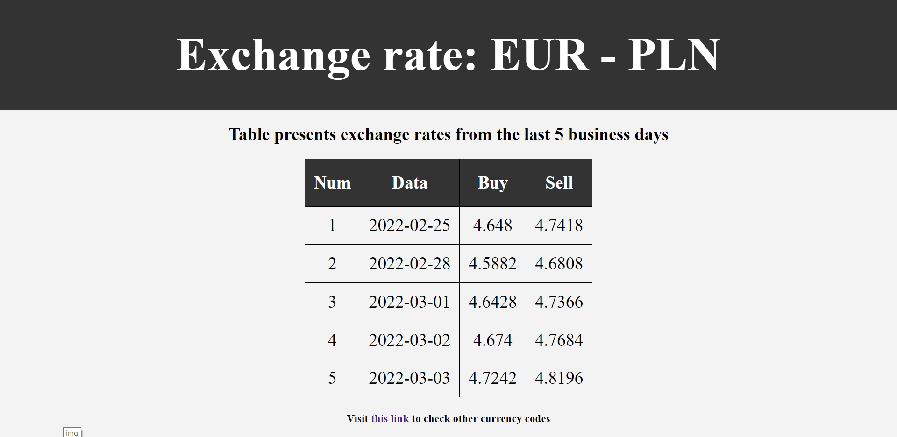
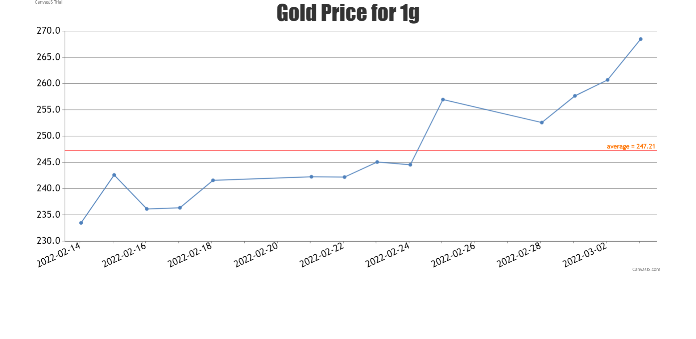

<h1 align="center">Spring Boot Service with NBP API</h1>
<span>
    
    
    
</span>

Spring boot service using NBP API to retrieve exchange rates data for last 5 business days and average gold price for last 14 business days.

---
## Tools used:  
- Java
- SpringBoot Framework
- Lombok
- HTML/CSS/JavaScript for front-end layer
- Thymeleaf
--- 
## API
### Exchange Rates
```http
GET /api/exchange-rates/{currencyCode}
```

| Parameter | Type | Description |
| :--- | :--- | :--- |
| `currencyCode` | `string` | **Required**. Currency code for exchange rate |  

Some of the currency codes [here](https://taxsummaries.pwc.com/glossary/currency-codes).

### Average Gold Price
```http
GET /api/gold-price/avarage
```

---
## UI Layer  
### EUR to PLN exchange rate  


### Gold average price  


